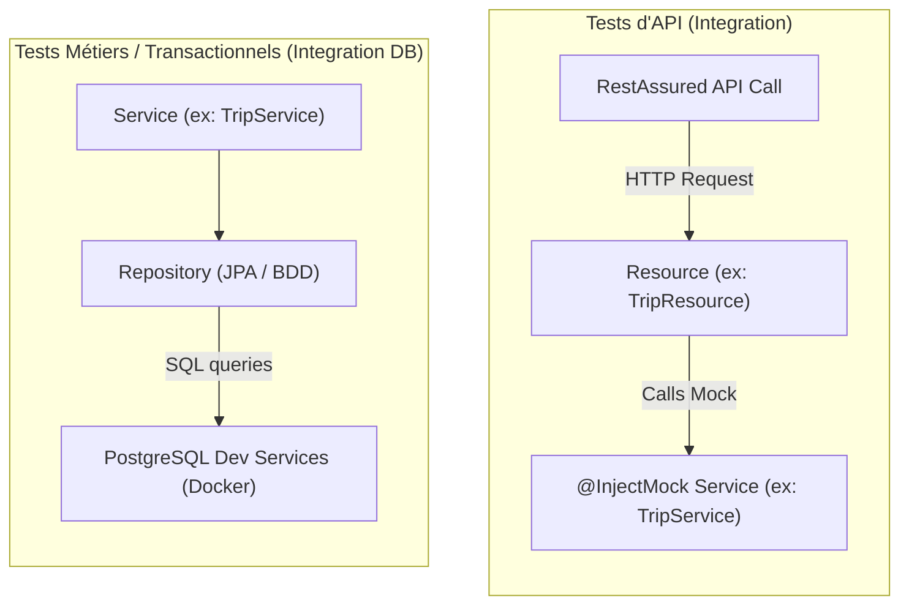

# 🧪 Plan d'Implémentation des Tests en TDD — GreenTrip

Ce document détaille la stratégie et le plan de développement piloté par les tests (TDD) pour le backend de **GreenTrip**. Quarkus facilite grandement cette approche grâce aux **Dev Services** (démarrage automatique de PostgreSQL dans Docker pour les tests) et à son intégration native de **RestAssured** et **Mockito**.

---

## 🛠️ 1. Dépendances requises pour les tests (`pom.xml`)

Pour tester correctement la sécurité et la validation, nous devons ajouter les dépendances de test suivantes :

```xml
<!-- Gestion simplifiée des contextes de sécurité dans les tests -->
<dependency>
    <groupId>io.quarkus</groupId>
    <artifactId>quarkus-test-security</artifactId>
    <scope>test</scope>
</dependency>
```

---

## 🎯 2. Stratégie de Test et Niveaux de Mocks

Nous distinguons deux approches complémentaires :



### 2.1 Mocks de Sécurité (`@TestSecurity`)
Puisque nos endpoints sont sécurisés par défaut avec `@Authenticated`, Quarkus permet de simuler un utilisateur connecté dans nos tests d'API sans avoir à configurer de vrais tokens JWT ou mécanismes de session complexes :

```java
@TestSecurity(user = "alex@takima.fr", roles = {"USER"})
```

### 2.2 Mocks de Composants (`@InjectMock`)
Pour isoler les contrôleurs REST de la base de données lors des tests d'exposition API, nous utiliserons l'annotation native de Quarkus `@InjectMock` (basée sur Mockito) pour court-circuiter les services.

---

## 📝 3. Plan d'Implémentation TDD par Feature

### 🚀 Feature 1 : Authentification & Création de Compte (`UserResource`)

#### Étape Red (Échec)
Écrire les cas de tests dans `UserResourceTest.java` :
1.  **Register Success** : `POST /api/users/register` avec des données valides doit renvoyer `201 Created` et le profil JSON.
2.  **Register Bad Request** : `POST /api/users/register` avec un email invalide ou un nom vide doit renvoyer `400 Bad Request` (Bean Validation).
3.  **Login Success** : `POST /api/users/login` avec des identifiants valides doit renvoyer `200 OK` et le `TokenResponse`.
4.  **Profile Secured** : `GET /api/users/me` sans authentification doit renvoyer `401 Unauthorized`.
5.  **Profile Authenticated** : `GET /api/users/me` avec `@TestSecurity` doit renvoyer `200 OK`.

#### Étape Green (Succès)
Implémenter la logique minimale dans `UserService` et `UserResource` pour faire passer tous ces tests.

#### Étape Refactor
Nettoyer le code, optimiser les requêtes SQL de vérification d'email unique dans le repository.

---

### 🚴 Feature 2 : Enregistrement d'un Trajet (`TripResource` & `TripService`)

Ici, nous testons la logique de calcul RSE (conversion distance -> points et CO2 économisé) en base de données réelle démarrée par Quarkus Dev Services.

#### Étape Red (Échec)
Écrire les cas de tests dans `TripServiceTest.java` (qui hérite de `@QuarkusTest`) :
1.  **Trip Calculation logic** : Déclarer un trajet de `10 km` en mode `VELO` pour un utilisateur. Vérifier en base que :
    *   La distance enregistrée est bien de `10.0`.
    *   Le CO2 évité est de `2.0 kg` (calculé avec le coefficient de 0.20 kg/km).
    *   Le solde de points gagnés est de `100` (calculé avec le coefficient de 10 points/km).
    *   Le solde de points de l'utilisateur a augmenté de `100`.
    *   L'impact global RSE de l'entreprise a augmenté de `10 km`, `2.0 kg` de CO2 et `100` points.

#### Étape Green (Succès)
Écrire les formules de calcul et les mises à jour d'entités JPA (`UserModel`, `CompanyModel`, `TripModel`) sous la transaction `@Transactional` dans `TripService`.

---

### 📊 Feature 3 : Classement des Entreprises (`CompanyResource` & `CompanyService`)

#### Étape Red (Échec)
Écrire les tests dans `CompanyResourceTest.java` :
1.  **Leaderboard Order** : Récupérer le leaderboard public via `GET /api/companies/leaderboard`.
    *   Vérifier que la route est bien publique (`@PermitAll`).
    *   Vérifier que la liste d'entreprises retournée est correctement ordonnée par performance décroissante de CO2 économisé par employé.
    *   Vérifier le bon fonctionnement des paramètres de requête `page` et `size`.

#### Étape Green (Succès)
Mettre en place la requête paginée triée dans `CompanyRepository` et appeler ce flux dans `CompanyService`.

---

## 🛠️ 4. Gabarits de Code pour démarrer les tests en TDD

### 4.1 Exemple de Test d'API : `UserResourceTest.java`
```java
package com.greentrip.resources;

import com.greentrip.dtos.requests.RegisterRequest;
import com.greentrip.dtos.responses.UserResponse;
import com.greentrip.entities.UserEntity;
import com.greentrip.services.UserService;
import io.quarkus.test.InjectMock;
import io.quarkus.test.junit.QuarkusTest;
import io.quarkus.test.security.TestSecurity;
import io.restassured.http.ContentType;
import org.junit.jupiter.api.Test;
import org.mockito.Mockito;
import java.time.LocalDateTime;

import static io.restassured.RestAssured.given;
import static org.hamcrest.CoreMatchers.is;

@QuarkusTest
public class UserResourceTest {

    @InjectMock
    UserService userService; // Mock du service pour isoler le contrôleur

    @Test
    public void testRegisterEndpointInvalidEmail() {
        RegisterRequest invalidRequest = new RegisterRequest(
            "Alex", 
            "invalid-email", // Format incorrect
            "password123", 
            3L
        );

        given()
          .contentType(ContentType.JSON)
          .body(invalidRequest)
        .when()
          .post("/api/users/register")
        .then()
          .statusCode(400); // Doit échouer sur la validation Bean
    }

    @Test
    public void testGetProfileSecuredByDefault() {
        given()
        .when()
          .get("/api/users/me")
        .then()
          .statusCode(401); // Pas d'auth -> Unauthorized
    }

    @Test
    @TestSecurity(user = "alex@takima.fr", roles = {"USER"})
    public void testGetProfileAuthenticated() {
        // Configuration du comportement du mock
        Mockito.when(userService.getProfile("alex@takima.fr"))
               .thenReturn(new UserEntity(1L, "Alex", "alex@takima.fr", "USER", 450, 9.2, 3L, LocalDateTime.now()));

        given()
        .when()
          .get("/api/users/me")
        .then()
          .statusCode(200)
          .body("name", is("Alex"))
          .body("email", is("alex@takima.fr"));
    }
}
```

### 4.2 Exemple de Test Métier (Intégration DB réelle) : `TripServiceTest.java`
```java
package com.greentrip.services;

import com.greentrip.dtos.requests.TripRequest;
import com.greentrip.entities.TripEntity;
import com.greentrip.models.CompanyModel;
import com.greentrip.models.UserModel;
import com.greentrip.repositories.CompanyRepository;
import com.greentrip.repositories.UserRepository;
import io.quarkus.test.junit.QuarkusTest;
import jakarta.inject.Inject;
import jakarta.transaction.Transactional;
import org.junit.jupiter.api.Assertions;
import org.junit.jupiter.api.BeforeEach;
import org.junit.jupiter.api.Test;

@QuarkusTest
public class TripServiceTest {

    @Inject
    TripService tripService;

    @Inject
    UserRepository userRepository;

    @Inject
    CompanyRepository companyRepository;

    private UserModel user;
    private CompanyModel company;

    @BeforeEach
    @Transactional
    public void setUp() {
        // Nettoyage de la base gérée automatiquement par Quarkus Dev Services
        userRepository.deleteAll();
        companyRepository.deleteAll();

        // Insertion d'une entreprise et d'un utilisateur de test
        company = new CompanyModel();
        company.name = "Takima";
        company.totalEmployees = 1;
        companyRepository.persist(company);

        user = new UserModel();
        user.name = "Alex";
        user.email = "alex@takima.fr";
        user.role = "USER";
        user.company = company;
        user.carbonPointsBalance = 0;
        user.totalCo2Saved = 0.0;
        userRepository.persist(user);
    }

    @Test
    public void testDeclareTripBusinessLogic() {
        TripRequest request = new TripRequest(10.0, "VELO");

        // Action
        TripEntity trip = tripService.declareTrip("alex@takima.fr", request);

        // Assertions sur le trajet retourné
        Assertions.assertNotNull(trip);
        Assertions.assertEquals(2.0, trip.co2Saved()); // 10 * 0.20
        Assertions.assertEquals(100, trip.pointsEarned()); // 10 * 10

        // Assertions sur l'utilisateur mis à jour
        UserModel updatedUser = userRepository.findById(user.id);
        Assertions.assertEquals(100, updatedUser.carbonPointsBalance);
        Assertions.assertEquals(2.0, updatedUser.totalCo2Saved);
    }
}
```
