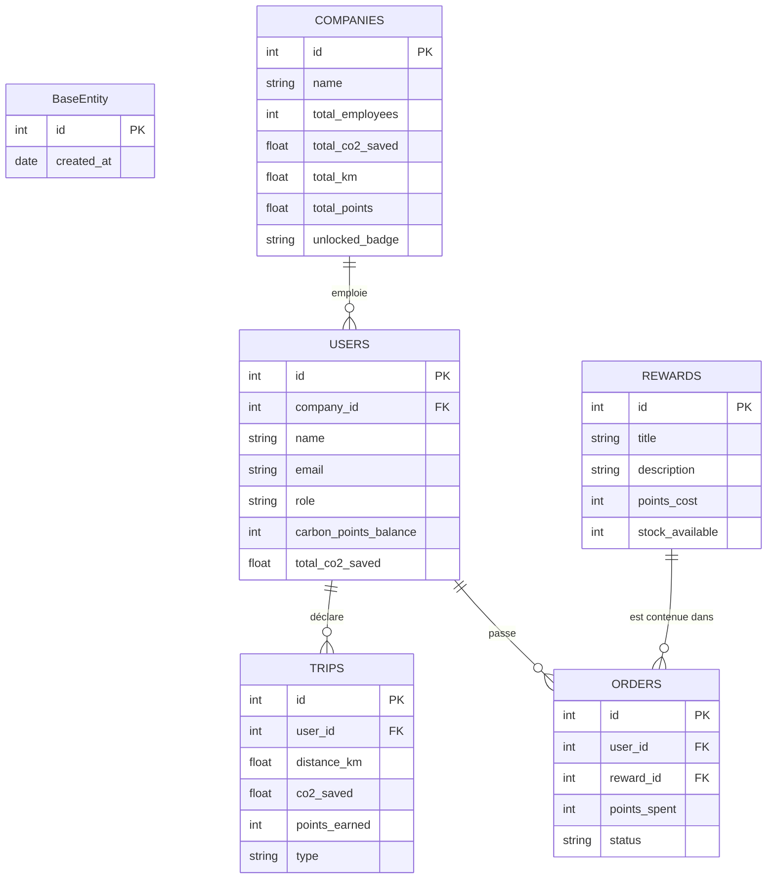

```mermaid
erDiagram
    BaseEntity {
        int id PK
        date created_at
    }
    COMPANIES {
        int id PK
        string name
        int total_employees
        float total_co2_saved
        float total_km
        float total_points
        string unlocked_badge
    }
    USERS {
        int id PK
        int company_id FK
        string name
        string email
        string role
        int carbon_points_balance
        float total_co2_saved
    }
    TRIPS {
        int id PK
        int user_id FK
        float distance_km
        float co2_saved
        int points_earned
        string type
    }
    REWARDS {
        int id PK
        string title
        string description
        int points_cost
        int stock_available
    }
    ORDERS {
        int id PK
        int user_id FK
        int reward_id FK
        int points_spent
        string status
    }

    COMPANIES ||--o{ USERS : "emploie"
    USERS ||--o{ TRIPS : "déclare"
    USERS ||--o{ ORDERS : "passe"
    REWARDS ||--o{ ORDERS : "est contenue dans"
```